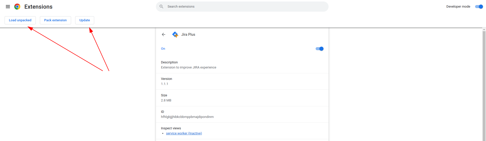

# How to update the extension

Currently, the extension is installed manually with the developer mode in chrome by downloading the repo. Do the following steps to update:

## Pull latest version from github

Pull the latest changes from the master branch of the [github repo](https://github.com/arcuo/jira-plus).


```sh
cd [path-to-repo]/jira-plus
git pull
```

## Run install and build

```sh
pnpm install
pnpm build

# or

yarn install
yarn build

```

## Open the extension manager in chrome

Open the url `chrome://extensions` in your browser and navigate to the **Jira plus** extension. Click either `Update` or `Load unpacked` and navigate to `[path-to-repo]/jira-plus/build` and click `Load`.


