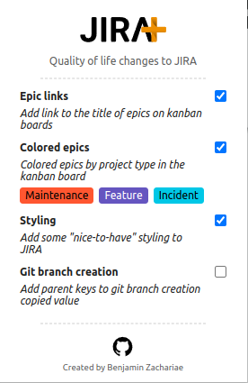

# &nbsp; &nbsp; &nbsp;

Quality of life changes to JIRA

## Features

- **Epic links**: Adds links to the epic titles in the board.
- **Styling**: Adds some styling to the JIRA board
  - Spacing to the expand button for epics
  - **Coming soon**: Enable/disable specific styling changes

## Manual install (Chrome)

Download the repo

```sh
# With github CLI
$ gh repo clone arcuo/jira-plus

# with git https
$ git clone https://github.com/arcuo/jira-plus.git
```

Build the project

```sh
$ cd jira-plus
$ yarn install
$ yarn build
```

Load the extension in chrome by going to `chrome://extensions/`. Set **Developer mode** true. Then click "Load unpacked" and navigate to  `../jira-plus/build` folder and select.

## Usage

You can enable the settings from the popup in the extension.



## Install

Links for firefox and chrome coming soon

## Manual install (Firefox)

### **NOTE: Not working currently**

First make sure that manifest V3 is available (see more [here](https://extensionworkshop.com/documentation/develop/manifest-v3-migration-guide/))

The developer preview of Manifest V3 is available in Firefox 101. However, to test your extensions you need to turn on the MV3 features. To do this, go to about:config and:

Set extensions.manifestV3.enabled to true.
Set xpinstall.signatures.required to false.
You can now install MV3 extensions from about:debugging.

Download the repo

```sh
# With github CLI
$ gh repo clone arcuo/jira-plus

# with git https
$ git clone https://github.com/arcuo/jira-plus.git
```

Use web-ext to run the extension

```sh
$ npm install --global web-ext
# or
$ yarn global add web-ext

```

Load the extension in chrome by going to `chrome://extensions/`

## Contribution

Suggestions and pull requests are welcomed!

---

This project was bootstrapped with [Chrome Extension CLI](https://github.com/dutiyesh/chrome-extension-cli)
