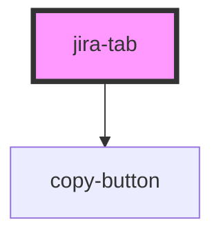

# jira-tab

<!-- Auto Generated Below -->

## Properties

| Property      | Attribute       | Description                                        | Type     | Default     |
| ------------- | --------------- | -------------------------------------------------- | -------- | ----------- |
| `jiraBaseUrl` | `jira-base-url` | JIRA url                                           | `string` | `undefined` |
| `jiraKey`     | `jira-key`      | jira issue key                                     | `string` | `undefined` |
| `title`       | `title`         | Title of the tab, i.e. the title of the jira issue | `string` | `undefined` |

## Dependencies

### Depends on

- [copy-button](../copy-button)

### Graph

----------------------------------------------

*Built with [StencilJS](https://stenciljs.com/)*
