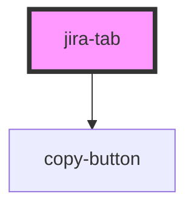

# jira-tab

<!-- Auto Generated Below -->

## Properties

| Property       | Attribute        | Description                                        | Type                 | Default     |
| -------------- | ---------------- | -------------------------------------------------- | -------------------- | ----------- |
| `actions`      | `actions`        |                                                    | `Action[] \| string` | `undefined` |
| `issueTitle`   | `issue-title`    | Title of the tab, i.e. the title of the jira issue | `string`             | `undefined` |
| `jiraBaseUrl`  | `jira-base-url`  | JIRA url                                           | `string`             | `undefined` |
| `jiraIssueKey` | `jira-issue-key` | jira issue key                                     | `string`             | `undefined` |

## Dependencies

### Depends on

- [copy-button](../copy-button)

### Graph

----------------------------------------------

*Built with [StencilJS](https://stenciljs.com/)*
